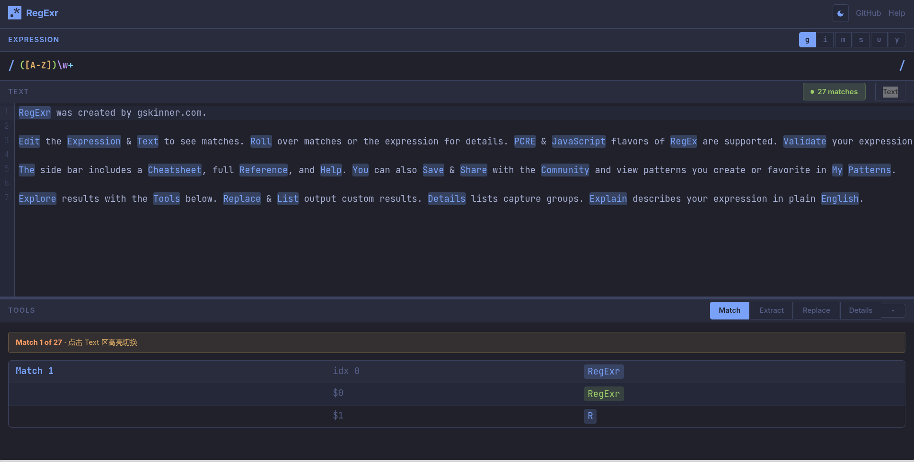

# RegExrWeb

RegExr 的 Web 克隆版，一个功能完整的正则表达式在线测试工具。

🔗 [GitHub](https://github.com/yuelwish/RegexrWeb) · 📝 [问题反馈](https://github.com/yuelwish/RegexrWeb/issues)

## 功能特性

- **实时匹配** - 输入正则表达式和文本，实时显示匹配结果
- **语法高亮** - 正则表达式语法着色（元字符、字符集、分组、量词等）
- **Web Worker** - 正则匹配在 Worker 线程执行，不阻塞 UI
- **模板系统** - 支持 Extract/Replace 模板（`$&`, `$1`, `\n` 等）
- **深色/浅色主题** - Tokyo Night 风格主题切换
- **拖拽布局** - 可调整 Text/Tools 区域比例
- **移动端适配** - 响应式设计

## 截图



## 快速开始

### 安装依赖

需要 pnpm 9+（项目使用 `.mise.toml` 管理版本）

```bash
pnpm install
```

### 开发

```bash
pnpm dev
```

打开浏览器访问 http://localhost:5173

### 构建

```bash
pnpm build
```

构建产物输出到 `dist/` 目录。

### 预览构建

```bash
pnpm preview
```

### 测试

```bash
pnpm test           # 运行所有测试
pnpm test:watch     # 监视模式
```

## 架构

### 核心模块

```
src/
├── engine/              # 核心引擎
│   ├── regex-solver.js  # 正则匹配入口（Worker 封装）
│   ├── regex-worker.js  # Worker 实现（实际匹配逻辑）
│   └── template-parser.js # 模板解析
├── ui/                  # UI 组件
│   ├── expression.js    # 正则输入框（语法高亮）
│   ├── text.js          # 文本编辑器（CodeMirror 6）
│   ├── tools.js         # 工具面板
│   └── header.js        # 顶部栏
├── utils/               # 工具函数
└── styles/              # CSS 样式
```

### Web Worker 正则匹配

正则匹配在 Worker 线程中执行，避免大文本匹配时阻塞 UI：

- **小文本** - 直接传递给 Worker
- **大文本 (>1MB)** - 使用 Transferable Objects 零拷贝
- **安全防护** - 最大 10000 次迭代或 100ms 超时

### 模板解析器

Extract/Replace 模板支持以下占位符：

| 占位符 | 说明 |
|--------|------|
| `$&` 或 `$0` | 完整匹配 |
| `$1`, `$2`... | 数字捕获组 |
| `${name}` | 命名捕获组 |
| `` $` `` | 匹配前的文本 |
| `$'` | 匹配后的文本 |
| `\n` | 换行符 |
| `\t` | Tab 符 |

## 技术栈

- **构建工具**: Vite 6
- **编辑器**: CodeMirror 6
- **测试框架**: Vitest (jsdom)
- **Worker 通信**: Comlink
- **字体**: Inter (UI) + JetBrains Mono (代码)

## 主题

使用 Tokyo Night 配色方案：

**深色主题（默认）**:
- 背景：`#1a1b26`
- 强调色：`#7aa2f7`
- 绿色：`#9ece6a`
- 红色：`#f7768e`

**浅色主题**:
- 背景：`#ffffff`
- 强调色：`#0969da`

## 部署

构建产物在 `dist/` 目录，可直接部署到任何静态服务器。

Nginx 配置示例：

```nginx
server {
    listen 80;
    root /path/to/dist;
    index index.html;
    
    location / {
        try_files $uri $uri/ /index.html;
    }
}
```

## 贡献

欢迎提交 Issue 和 Pull Request！

## 许可证

Apache License 2.0

Copyright 2026 yuelwish

Licensed under the Apache License, Version 2.0 (the "License");
you may not use this file except in compliance with the License.
You may obtain a copy of the License at

    http://www.apache.org/licenses/LICENSE-2.0

Unless required by applicable law or agreed to in writing, software
distributed under the License is distributed on an "AS IS" BASIS,
WITHOUT WARRANTIES OR CONDITIONS OF ANY KIND, either express or implied.
See the License for the specific language governing permissions and
limitations under the License.

## 致谢

- [RegExr](https://regexr.com/) - 原始项目灵感
- [CodeMirror](https://codemirror.net/) - 代码编辑器
- [Tokyo Night](https://github.com/enkia/tokyo-night-vscode-theme) - 配色方案
